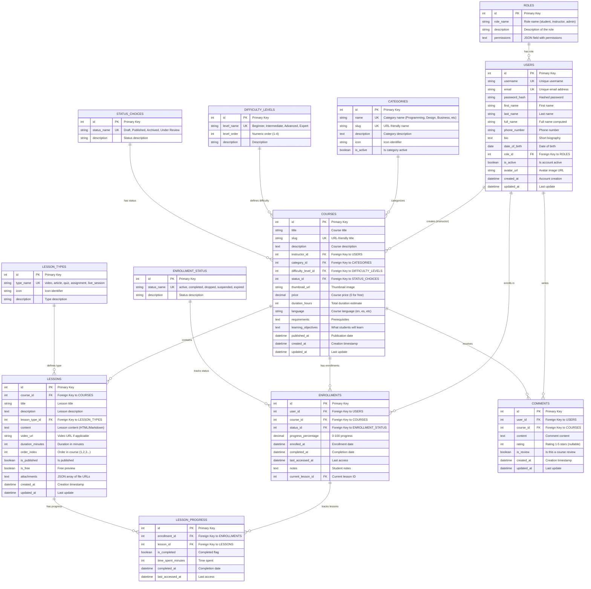

# LMS Project Using Django REST Framework

This project is a Learning Management System (LMS) built using Django and Django REST Framework. It provides a RESTful API for managing users, profiles, courses, lessons, enrollments, and comments.

## Features

- User registration and authentication
- Profile management
- Course and lesson management
- Enrollment in courses
- Commenting on courses and lessons
- Filtering and searching capabilities
- API documentation with Swagger


## DB Diagrams



## Installation

1. Clone the repository:

   ```bash
   git clone https://github.com/chavarc97/lms.git
   cd lms
   ```
2. Create a virtual environment and activate it:

   ```bash
   python -m venv venv
   source venv/bin/activate  # On Windows use `venv\Scripts\activate`
   ```
3. Install the required packages:

   ```bash
   pip install -r requirements.txt
   ```
4. Run Docker-Compose && run the server:

   ```bash
   docker-compose up --build
   ```
5. Apply migrations:

   ```bash
   docker exec -it lms-web-1 python manage.py migrate
   ```
6. Create a superuser:

   ```bash
   docker exec -it lms-web-1 python manage.py createsuperuser
   ```
7. (Optional) Populate the database with initial data:

   ```bash
   # Forma básica
   docker-compose exec web python manage.py populate_db

   # Con salida en color
   docker-compose exec web python manage.py populate_db --no-color

   # Ver la salida en tiempo real
   docker-compose exec web python manage.py populate_db --verbosity 2
   ```
8. Access the application:

   - API: `http://localhost:8000/api/`
   - Admin Panel: `http://localhost:8000/admin/`
   - Swagger Documentation: `http://localhost:8000/swagger/`
   - Redoc Documentation: `http://localhost:8000/redoc/`


